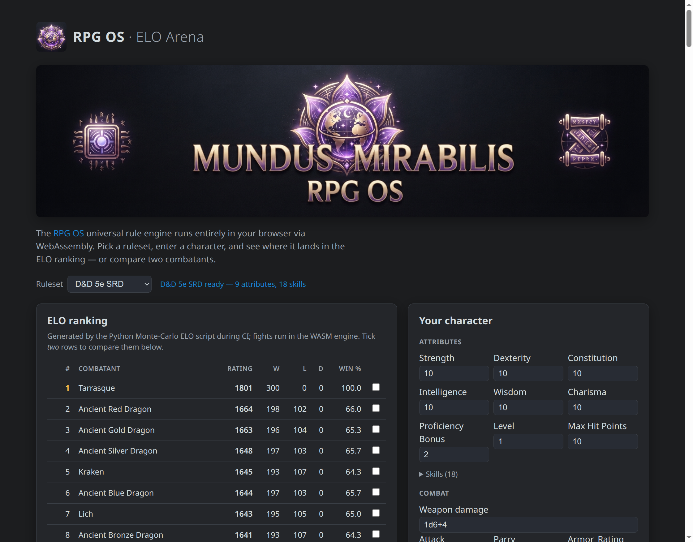

# RPG OS

> The part of a tabletop RPG that survives when you take the fantasy away.

**RPG OS** is a universal, header-only **C++23** rule engine for tabletop
role-playing games. Take any system — D&D, The Dark Eye, Basic Roleplaying, or
one you invented yourself — and strip away the flavour. What remains is the
same mechanical skeleton every time: characters have attributes and skills,
dice are rolled against thresholds, armour absorbs damage, fights are decided
by repeated checks, and characters grow. That skeleton is pure bookkeeping,
and it is exactly what RPG OS implements — the boring parts that support the
fantasy, so you can spend your energy on the wonderful world instead
(*mundus mirabilis* — a wonderful world).

**RPG OS is universal: it does not know — or care — which rule system you
play.** Rules live in plain JSON files, and the engine reads *any* of them at
runtime. It ships with three complete systems as working examples — **D&D 5th
Edition (SRD)**, **The Dark Eye 5th Edition**, and **Basic Roleplaying** — but
adding a fourth is writing one JSON file, never touching the engine.


## Try it: the ELO Arena

See the engine at work with zero setup. The **ELO Arena** is a live demo that
runs RPG OS in your browser via WebAssembly:

- a **leaderboard** of every combatant in a ruleset, ranked by a Monte-Carlo
  ELO tournament — each rating comes from simulating thousands of fights,
- a **character form** that lets you enter an arbitrary character (no ruleset
  entry needed) and ranks it *live* against the top combatants,
- **head-to-head** win probabilities between any two combatants, with an
  optional live 100-fight confirmation.



**→ [Open the ELO Arena](https://mundus-mirabilis.github.io/RPG-OS/main/demo/)**

## What it does

RPG OS models the mechanical layer a game master or a digital tool needs:

- **Characters** — attributes, derived stats (formulas), resource pools
  (hit points, mana, …), equipment, inventory, money, encumbrance, conditions,
  spells and advancement — all as data, driven by the ruleset.
- **Checks** — d20, 3d20 and percentile resolution, covering threshold,
  skill-pool, opposed and resistance rolls, with advantage/disadvantage,
  difficulty, criticals and fumbles.
- **Combat** — full fights between two entities (or a whole session with
  initiative), with attack/defence checks, damage pipelines, armour absorption
  and event-driven conditions.
- **Bookkeeping** — conditions with durations, rests, spell slots or a mana
  pool, experience and level-ups, money and item prices.
- **Spells & effects** — structured, machine-readable spell effects (damage,
  conditions, healing, temporary hit points, resistances, bonus dice, ongoing
  per-round effects) resolved by the engine, including caster-quality
  (QL)-scaled formulas.

None of this is hard-coded. Every mechanic above is described by the ruleset
JSON — the engine is a generic interpreter.

## Two ways to use it

Both modes share one template-based core, so a check resolved in one mode is
byte-identical in the other (a parity test enforces this).

### Universal mode — the dynamic engine

Load **any** ruleset JSON at runtime and resolve rules generically. No
recompilation: a new game system is just a new JSON file.

```cpp
#include <rpg_os/universal/engine.hpp>

rpg_os::RulesetEngine engine;
engine.loadRulesetFromFile("rulesets/tde5e_core.json");

auto geron = engine.createEntity("geron");          // from a named archetype
std::cout << geron.getStat("COU");                  // 12
std::cout << geron.getResource("LP");               // 31 = 5 + 2·CON
```

### Specific mode — generated, strongly typed code

`codegen/rpg_os_codegen.py` compiles a ruleset's *schema* into a strongly
typed header with named members and methods (`courage()`, `baseAttack()`,
`climbCheck()`, …). Formulas compile to C++, checks use `constexpr` configs,
and attributes are stored in the narrowest fitting type — no dynamic
allocation in the hot path. The character data still comes from the ruleset
JSON at runtime.

```cpp
#include <tde5e_core_static.hpp>                    // generated by the codegen

const auto geron = rpg_os::generated::tde5e::Character::fromArchetype(ruleset, "geron");
rpg_os::CheckParams params;
rpg_os::DefaultRandom rng;
const auto climb = geron.checkClimbing(params, rng); // 3d20 vs COU/AGI/STR
```

**When to use which?** Start with *universal mode* — it is one header, works
with any ruleset, and is ideal for tools, editors, web builds and quick
prototyping. Reach for *specific mode* when you want compile-time names and
maximum speed on a known ruleset.

## Also on the web — the npm package

The universal engine is compiled to **WebAssembly** and published as
[`@mundus-mirabilis/rpg-os`](https://www.npmjs.com/package/@mundus-mirabilis/rpg-os) —
usable in **Node.js** and the **browser**, with any ruleset JSON:

```js
import { init } from '@mundus-mirabilis/rpg-os';
const rpg = await init();
rpg.loadRulesetFromFile('rulesets/tde5e_core.json');  // Node; browsers fetch() the JSON
const geron = rpg.createEntity('geron');
const outcome = rpg.fight(rpg.specFromEntity(geron), rpg.specFromId('toad'), { seed: 42 });
```

## Documentation

The full documentation is generated with Doxygen and published on GitHub Pages
for every branch and release. It is split into two clearly separated paths:

- **[User Guide](https://mundus-mirabilis.github.io/RPG-OS/develop/user_guide.html)** —
  everything you need to build a game or tool on RPG OS: the universal and the
  generated libraries, the examples, and how to create a new ruleset JSON.
- **[Developer Guide](https://mundus-mirabilis.github.io/RPG-OS/develop/developer_guide.html)** —
  for people working on RPG OS itself: architecture, the shared template core,
  the code generator, testing and the WASM port.
- **[API reference](https://mundus-mirabilis.github.io/RPG-OS/develop/)**
  (Doxygen) — the complete reference for every header, class and function.

| URL | Content |
| --- | --- |
| <https://mundus-mirabilis.github.io/RPG-OS/develop/>   | **Current development** |
| <https://mundus-mirabilis.github.io/RPG-OS/main/>      | **Latest release** |
| <https://mundus-mirabilis.github.io/RPG-OS/main/demo/> | **ELO Arena** (live demo) |

## Building (for C++ users)

RPG OS is header-only: add `include/` and `generated/` to your include path
and link nothing. With CMake, consume the `rpg_os::rpg_os` interface target:

```sh
cmake -S . -B build -G Ninja -DCMAKE_BUILD_TYPE=Release
cmake --build build
ctest --test-dir build --output-on-failure
```

Useful CMake options:

| Option | Default | Effect |
| --- | --- | --- |
| `RPG_OS_BUILD_TESTS` | `ON` | Build the test suite |
| `RPG_OS_WARNINGS_AS_ERRORS` | `OFF` | Treat compiler warnings as errors |
| `RPG_OS_ENABLE_SANITIZERS` | `OFF` | Build with AddressSanitizer + UBSan |
| `RPG_OS_RUN_CODEGEN` | `OFF` | Regenerate `generated/*.hpp` during the build |
| `RPG_OS_BUILD_DOCS` | `ON` | Render the Doxygen documentation into `html/` (gitignored) |

Requires CMake ≥ 3.24 and a C++23-capable toolchain whose standard library
provides `<expected>`: GCC ≥ 13 (libstdc++ ≥ 13), or Clang ≥ 17 with libc++ ≥ 17
(Apple clang on macOS, or `-stdlib=libc++` on Linux). Clang 17/18 with GNU
libstdc++ 13 does not provide `<expected>` — use Clang ≥ 19 with libstdc++
instead.

The example programs are small, self-contained demos of both modes, the combat
simulator and the ECS patterns — see the [examples](examples/README.md).

## Licences — read this

The **engine code** in this repository is **Apache-2.0**. The **ruleset JSON
files are NOT**: each is governed by the licence stated in its own required
`licence` field (e.g. `CC-BY-4.0`, or the Open RPG Creative License). Never
assume a ruleset's content is Apache-2.0 — check the `licence` field of the
individual file (and its optional `licence_source` link) before redistributing
or modifying it. The ELO Arena shows the loaded ruleset's licence at runtime.

| Ruleset | Licence | Licence stated at |
| --- | --- | --- |
| `dnd5e_srd.json` | CC-BY-4.0 | [dndbeyond.com/srd](https://www.dndbeyond.com/srd) |
| `tde5e_core.json` | Open RPG Creative License (ORC) | [ulisses-spiele.de — ORC](https://ulisses-spiele.de/die-deutsche-orc-ist-da/) |
| `brp_ugc.json` | Open RPG Creative License (ORC) | [chaosium.com/orc-license](https://www.chaosium.com/orc-license/) |

Each ruleset is a single JSON file validated against
[`rulesets/ruleset.schema.json`](rulesets/ruleset.schema.json). The
[User Guide](https://mundus-mirabilis.github.io/RPG-OS/develop/user_guide.html)
explains the ruleset format and how to create your own.

## Project layout (orientation)

```
include/rpg_os/
├── common/       shared value types, JSON, event system
├── core/         shared header-only template core (checks, dice, entity, …)
├── universal/    dynamic mode: loader, evaluator, engine, combat
├── specific/     runtime support used by generated code
└── third_party/  vendored headers (never edit)
codegen/          rpg_os_codegen.py + validate_ruleset.py
rulesets/         the ruleset JSON files + ruleset.schema.json
generated/        committed codegen outputs (strongly typed headers)
tests/            doctest suite (incl. universal↔specific parity)
examples/         demo programs
scripts/          elo_ranking.py (Monte-Carlo ELO tournament)
wasm/             WebAssembly port + the @mundus-mirabilis/rpg-os npm package
web/demo/         the ELO Arena live demo
```

The detailed layout and every internal convention live in the
[Developer Guide](https://mundus-mirabilis.github.io/RPG-OS/develop/developer_guide.html).

## The ELO ranking, under the hood

`scripts/elo_ranking.py` ranks every combatant of a ruleset with a Monte-Carlo
ELO tournament: a Swiss pairing (each combatant plays one similar-rated
opponent per round, so it needs `O(rounds · n)` fights instead of `O(n²)`),
executed in parallel processes. Each fight is a full `runFight` simulation in
the native engine. Every random consumer follows the same rule —
*explicitly seeded = exactly reproducible, unseeded = varied on every run*:

```sh
python3 scripts/elo_ranking.py --ruleset rulesets/dnd5e_srd.json --jobs 8 --rounds 40 --games 10
```

The leaderboard on the ELO Arena page is generated by this script during CI;
the page itself only ports the small ELO formula to JavaScript so it can rank
your entered character live, in the browser, without a server.
